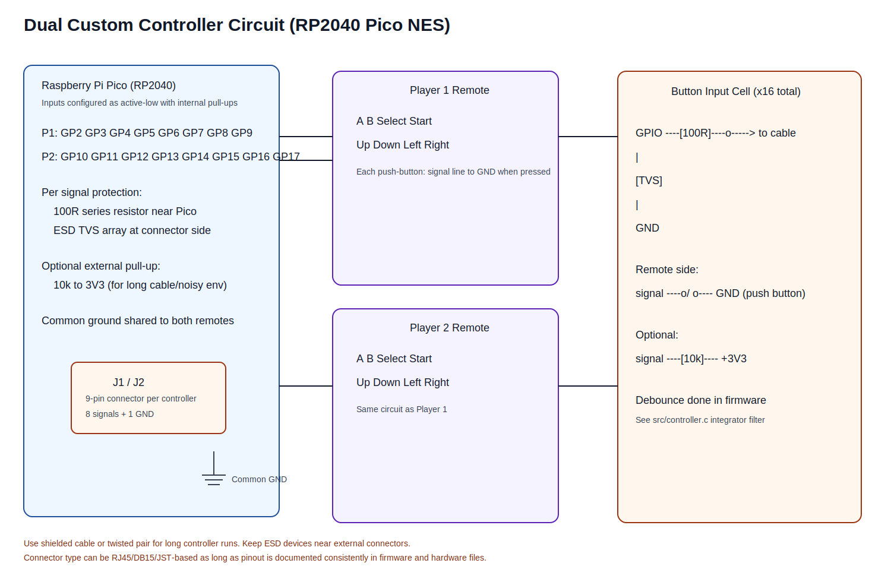

# Dual Remote Wiring

This file defines practical wiring for two custom controller handsets.

## Per-Controller Connections

Each remote requires 9 wires:

- 8 signal lines (A, B, Select, Start, Up, Down, Left, Right)
- 1 shared GND

## Recommended Connector

- RJ45 or DB15 style connector for durability
- Add strain relief for cable pull resistance

## Pull-ups

Internal RP2040 pull-ups are enabled in firmware.
For noisy cables, add external 10k pull-ups near MCU if needed.

## Suggested Protection

- 100R series resistor per signal near RP2040 pin
- ESD diode array on external connector

## Button Circuit Cell

Per button wiring (active-low):

- Signal line from RP2040 GPIO
- Push button between signal and GND
- Optional 10k pull-up to 3V3 for long/noisy cable runs

## Debounce

Debounce is implemented in firmware (`controller.c`) using an integrator filter.

## Files

- Diagram: `hardware/controllers/controller_circuit_diagram.svg`
- Wiring notes: `hardware/controllers/wiring.md`
